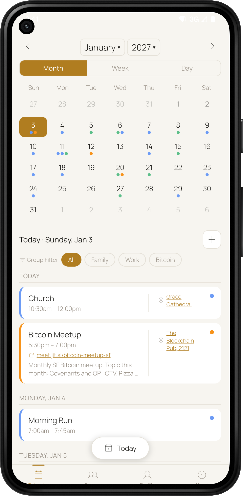
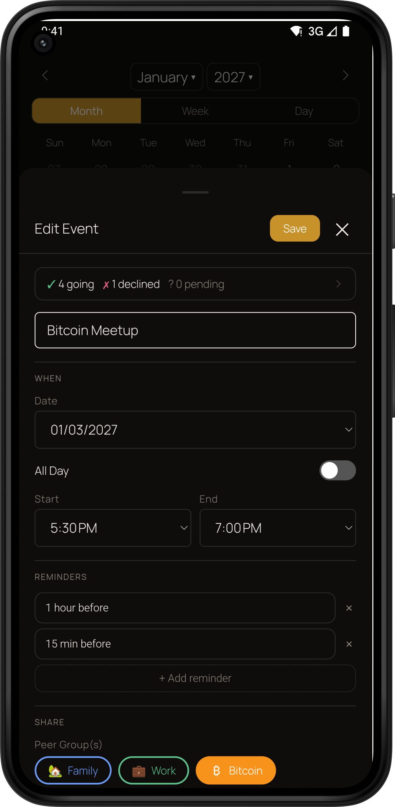
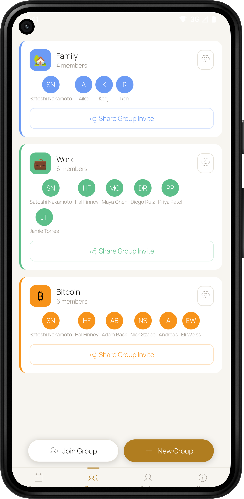
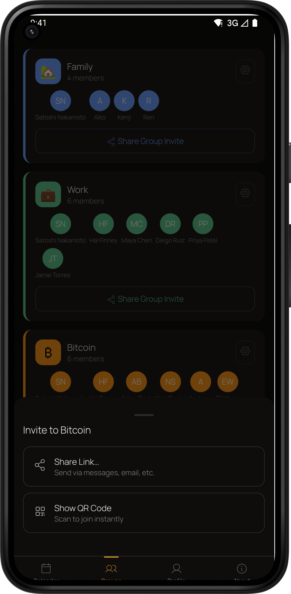
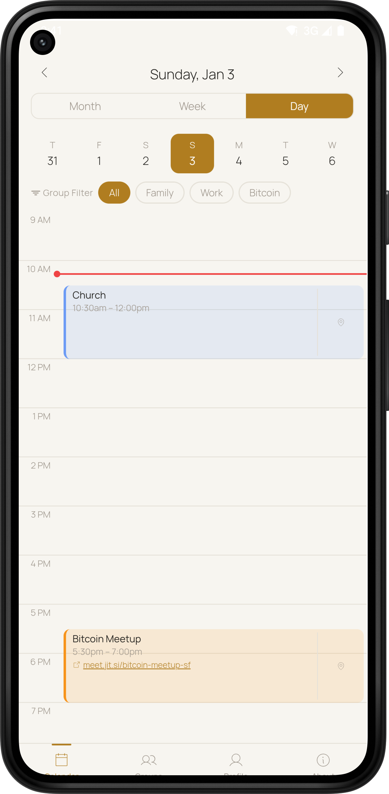

# 🍐 PearCal

**A decentralized calendar sharing app for Android, iOS and desktop.**

PearCal syncs your calendar directly between devices - no accounts, no servers, no subscriptions. Your data lives only on the devices in your groups.

Part of the [PeerLoom](https://peerloomllc.com) suite of account-free, peer-to-peer apps.

---

## Features

- **Shared group calendars** - create a group, invite family or friends via a link, and your events sync automatically. Sharing is free and needs no plan, no server and no account for anyone in the group
- **Import and export `.ics`** - bring events in from another calendar and take yours with you, so nothing is locked in
- **Fully offline-first** - works without an internet connection; syncs whenever devices are on the same network or can reach each other over the internet
- **Event reminders** - per-event reminder notifications with customizable lead times
- **Recurring events** - daily, weekly, bi-weekly, monthly and yearly repeat with a configurable end date
- **Event locations** - add an address or place to any event; tap 🧭 to open it in your maps app
- **Custom group colors** - color-code your groups for quick visual identification
- **Profile photos** - set a photo or avatar that appears across all your groups
- **Dark mode** - automatic dark theme throughout
- **No accounts** - your identity is a cryptographic key pair generated on your device; nothing is tied to an email or phone number
- **No data collection** - no company, including us, ever sees your calendar data

---

## How It Works

PearCal uses **peer-to-peer technology** powered by [Hypercore Protocol](https://hypercore-protocol.org) to sync your calendar directly between devices.

### No servers
Most calendar apps (Google Calendar, Apple Calendar, etc.) store your data on a central server. The app company can read your events, sell your data, get hacked, go down or shut down. PearCal has no central server. Your calendar data never leaves your devices.

### How sync works
When two devices in the same group are online at the same time - whether on the same Wi-Fi network or anywhere on the internet - they find each other using a distributed hash table (DHT), a technology similar to how BitTorrent works. Once connected, they sync directly, device to device, with no middleman.

### Encrypted by default
All data is encrypted in transit using the same cryptographic primitives that secure modern messaging apps. Nobody on the network can read your calendar data except the devices in your groups.

### What about offline changes?
PearCal is designed to handle this gracefully. If you add an event while offline, it will sync to your group members the next time your devices connect. Conflicts are resolved automatically using a last-write-wins strategy.

### Invites
Joining a group works via an invite link or QR code. The link encodes the cryptographic address of the group - there's no server involved. Share it however you like: copy it to a message, share it via the system share sheet or let someone scan your QR code directly. If you remove a member, their link expires and they can no longer sync.

### Optional blind seeder
Because there is no server, a group syncs only while two of its devices are
online together. If you want a group to stay reachable when every phone is
asleep, you can run the **blind seeder** on hardware you own.

It is blind by construction. It replicates the group's encrypted blocks and can
report only counts - bytes, blocks, writers and peers - never contents. It holds
no key that could decrypt an event. The group admits a seeder explicitly and can
revoke it group-wide.

Packaging lives in [`seeder-launcher/`](seeder-launcher/), including an Umbrel
app manifest and a script that builds the Start9 `.s9pk`. Running one is entirely
optional; PearCal
works without it.

---

## Screenshots

  
  
  
  
  

---

## Privacy

- No accounts or sign-up required
- No analytics, tracking or telemetry
- No third-party SDKs
- Location search is not used - locations are plain text to avoid sending queries to external services
- All sync traffic is encrypted end-to-end

---

## Desktop (beta)

PearCal also runs on macOS, Windows and Linux as a native desktop app built on Electron, sharing the same peer-to-peer backend as mobile. Desktop and mobile pair into a single identity - events, groups and reminders sync between every device on the same identity.

Installers are produced by the local build scripts in `electron/scripts/` and land in `electron/dist/`:

- **macOS**: `PearCal-X.Y.Z-arm64.dmg` and `PearCal-X.Y.Z.dmg` - signed with a Developer ID Application certificate. Hardened runtime and notarization are currently **off**, because macOS Sequoia's local-network handling does not recognize Hyperswarm's raw sockets under the hardened runtime. Restoring them is tracked as an open item, so expect an "unidentified developer" prompt on first launch
- **Windows**: `PearCal Setup X.Y.Z.exe` - NSIS installer, currently unsigned (Authenticode signing not yet wired), so SmartScreen warns on first download
- **Linux**: `PearCal-X.Y.Z.AppImage` and `pearcal-electron_X.Y.Z_amd64.deb`

Pairing on desktop uses the same `pearcal://pair?topic=…` URL the mobile app generates - paste it into the onboarding sheet, click it from a browser or scan a QR code from a phone. Camera capture and QR scanning are not wired on desktop, by design.

The full architecture pivot from the original Pear runtime to Electron is documented at `docs/superpowers/plans/2026-04-27-pear-desktop-electron-pivot.md` - that's the canonical reference for build pipeline, signing posture, native module replacements and what survives vs. what was replaced.

Known coverage gaps:
- **Linux distro coverage**: only Debian (`.deb` via apt) has been verified end-to-end. The AppImage and other distros (Fedora, Arch) are likely fine but not yet smoke-tested.
- **UI density**: the calendar UI still renders as a stretched mobile layout on a wide window. A desktop-tailored multi-pane redesign is tracked separately and not part of this beta.

---

## Known Limitations

- **Two devices must be online at the same time** to sync - there is no push delivery when every device in a group is offline at once. Running the optional blind seeder removes this limitation, because the seeder is always online
- **No CalDAV** - PearCal will not subscribe to or two-way-sync an existing Google, iCloud or work calendar. It is a shared calendar for a group, not a replacement client for a hosted one. Use `.ics` import and export to move events between them
- **It does not hide anything from your group members** - the design keeps your calendar away from any server operator, including us. Everyone you invite to a group sees that group's events

---

## License

[MIT](LICENSE) © 2026 PeerLoom LLC

---

## Feedback & Bug Reports

Please open an [issue](../../issues) on GitHub. Include your platform (Android, iOS or desktop), OS version and a description of what happened.
